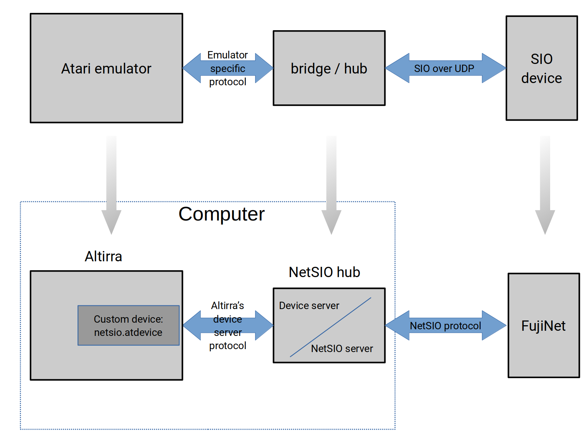

# fujinet-emulator-bridge

* fujinet-bridge - reflects SIO bus from the emulator to FujiNet and back.
* altirra-custom-device - The custom .atdevice to allow fujinet-bridge to connect to Altirra.

High level diagram:

The top part of the diagram shows generic building blocks. At the bottom part the current implementation is depicted.

[Altirra](https://virtualdub.org/altirra.html) is a popular Atari emulator which runs under Windows. Linux users can run it with Wine. Custom devices can be "connected to Atari" in Configure System / Peripherals / Devices dialog. `netsio.atdevice` is  a device which connects Altirra with NetSIO hub.

The role of NetSIO hub is to rely data and signals from emulated SIO bus to all connected devices. `netsio-hub.py` is written in Python 3 and it must be running on the same computer as Altirra.

Signals and data on SIO bus are translated and send over network as UDP datagrams. This is handled by  [NetSIO](netsio.md) protocol.

## Installing

Copy the file [netsio.atdevice](altirra-custom-device/netsio.atdevice) to folder `<ALTIRRA_BASEDIR>/extras/sampledevices` on your PC. Copy the file [netsio-hub.py](fujinet-bridge/netsio-hub.py) to folder `<ALTIRRA_BASEDIR>/extras/deviceserver`. Replace `<ALTIRRA_BASEDIR>` with a real path where the Altirra is installed, for example: `C:/Altirra`.

## Running

- Start NetSIO hub

  `python3 netsio-hub.py`

- Connect Altirra with NetSIO hub

  In Altirra: System > Configure System ... under Peripherals / Devices add Custom device (scroll down) and select `netsio.atdevice`

- Connect FujiNet with NetSIO hub

  In FujiNet web interface, in Emulator settings enable SIO over Network option and fill in host name or IP address of computer running Altirra and hub. Save settings.

- To boot emulated Atari from FujiNet (optional)

  * First, `D1:` must be removed from Altirra: File > Detach Disk > Drive 1
  * Ensure Fast boot feature is disabled: System > Configure System > Acceleration > uncheck Fast boot in OS acceleration
  * Reboot the emulated Atari with `Shift+F5`.

- It is possible to use emulated disk devices in Altirra together with FujiNet. It's like to run FujiNet with other disk drives connected. Some disks can be from FujiNet, other disks can be emulated by Altirra. Take care to use different drive numbers.

